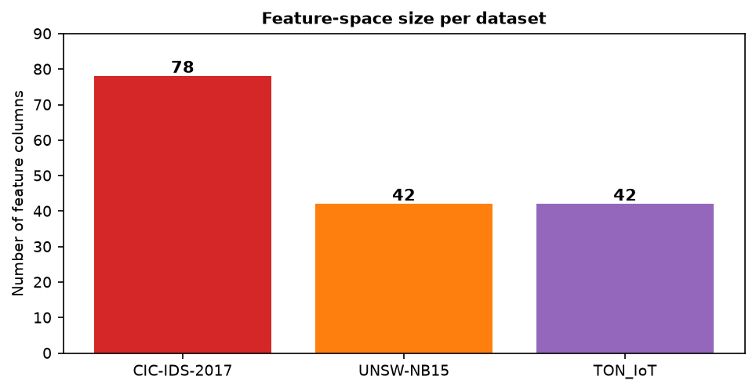

# Dataset Report — Understanding the Three Benchmark Network-Intrusion Datasets

**Project:** Evaluating and Improving Cross-Dataset Generalization of ML-Based Intrusion Detection Systems
**Document:** 01 — Dataset Analysis
**Status:** Prepared for mid-semester review

---

## 1. Executive Summary

This report documents a first-hand analysis of the three benchmark network-traffic datasets
selected for this project: **CIC-IDS-2017**, **UNSW-NB15**, and **TON_IoT**. The analysis was
performed directly on the downloaded CSV files (statistics recomputed by the authors, not
quoted from the literature), and it reveals the single most important structural fact of the
project:

> The three datasets were produced by **different collection tools and represent almost
> disjoint feature spaces**. CIC-IDS-2017 exposes 78 CICFlowMeter flow statistics,
> UNSW-NB15 exposes 42 Argus/Bro hybrid counters, and TON_IoT exposes 42 raw Zeek (Bro)
> log fields. Only a small handful of features are semantically equivalent across all three.
> Any "cross-dataset" experiment must therefore either (a) restrict itself to a small shared
> feature subspace, or (b) build dataset-specific models that cannot be directly transferred.

This feature-schema mismatch is not an obstacle to be worked around — it is the central
phenomenon the project studies, because it is precisely what a real, deployable Intrusion
Detection System (IDS) faces when it encounters a network it has never seen before.

All figures referenced in this document are stored under `reports/figures/`.

---

## 2. Datasets at a Glance

| Property | CIC-IDS-2017 | UNSW-NB15 | TON_IoT (network) |
|---|---|---|---|
| Origin | Canadian Institute for Cybersecurity (CIC), Univ. of New Brunswick | Australian Centre for Cyber Security (ACCS), UNSW Canberra | UNSW Canberra / Moustafa et al. |
| Year | 2017 | 2015 | 2019–2020 |
| Collection tool | CICFlowMeter (flow exporter) | Argus + Bro-IDS hybrid | Zeek (Bro-IDS) connection logs |
| Network type | Enterprise/office LAN | Emulated enterprise (IXIA PerfectStorm) | IoT / IIoT testbed (edge–fog–cloud) |
| Total records (this copy) | 2,830,743 | 257,673 (train 175,341 + test 82,332) | 211,043 |
| Feature columns | 78 (one duplicated → 77 unique) | 42 (+ `id`, `attack_cat`, `label`) | 42 (+ `label`, `type`) |
| Label scheme | `Label` (per-attack string) | `attack_cat` (9 classes + Normal) + binary `label` | `type` (10 classes) + binary `label` |
| Missing / infinite values | 1,358 NaN + 4,376 Inf | none | none |
| Key structural traits | Extreme class imbalance; identity features (ports) | Partly de-identified (IPs/ports already removed) | Heavy categoricals (`conn_state`, `dns_*`, `http_*`, `ssl_*`) |

---

## 3. CIC-IDS-2017

### 3.1 Provenance and collection methodology

CIC-IDS-2017 [5] is the most widely used intrusion-detection benchmark. It was captured at
the Canadian Institute for Cybersecurity over five working days (Monday–Friday, July 2017)
on a realistic testbed that emulated a small enterprise network: victim machines, a firewall,
and an attacker network. Realistic background (benign) traffic was generated with a
behavioural profiling tool (B-Profile), while attacks were executed on specific days. Flows
were extracted with **CICFlowMeter**, which computes 78+ statistical features per
bidirectional flow (packet-length statistics, inter-arrival times, TCP flag counts, bulk and
sub-flow statistics, and active/idle timing).

The dataset ships as eight per-day CSV files under
`datasets/CIC-IDS-2017/MachineLearningCVE/`.

### 3.2 File-by-file composition (measured)

| File | Rows | Attack labels present |
|---|---|---|
| Monday-WorkingHours | 529,918 | BENIGN only |
| Tuesday-WorkingHours | 445,909 | BENIGN, FTP-Patator, SSH-Patator |
| Wednesday-workingHours | 692,703 | BENIGN, DoS Hulk/GoldenEye/slowloris/Slowhttptest, Heartbleed |
| Thursday-WorkingHours-Morning-WebAttacks | 170,366 | BENIGN, Web Attack – Brute Force/XSS/Sql Injection |
| Thursday-WorkingHours-Afternoon-Infilteration | 288,602 | BENIGN, Infiltration |
| Friday-WorkingHours-Morning | 191,033 | BENIGN, Bot |
| Friday-WorkingHours-Afternoon-DDos | 225,745 | BENIGN, DDoS |
| Friday-WorkingHours-Afternoon-PortScan | 286,467 | BENIGN, PortScan |

**Full label distribution (log scale):**

Key observations:

- **BENIGN dominates** (2,273,097 of 2,830,743 ≈ 80.3%). Attacks total ≈ 557,646 (19.7%).
- **DoS Hulk is the single largest attack class** (231,073), followed by PortScan (158,930)
  and DDoS (128,027).
- **Extreme minority classes:** Heartbleed (11) and Infiltration (36) are effectively
  unlearnable in a per-dataset setting and would be *impossible* to transfer cross-dataset.
- **Label encoding issue:** the Web-Attack labels contain a non-ASCII en-dash that reads as a
  replacement character (`Web Attack � Brute Force`) under default UTF-8 decoding. Labels must
  be normalised before use.

### 3.3 Feature schema

The header contains **79 columns**: 78 numeric feature columns plus the `Label` column. One
feature — `Fwd Header Length` — is **duplicated** (appears twice; pandas renames the second
occurrence to `Fwd Header Length.1`), so there are **77 unique features**. Notable schema
characteristics:

- Features are **numeric flow statistics** (no categorical protocol/service columns).
- The only categorical column is `Label`.
- The first column `Destination Port` is a *de-facto identity feature* (see §6): it encodes
  the attack scenario rather than traffic behaviour and is a known source of inflated
  same-dataset accuracy [1], [15].

### 3.4 Data-quality issues (measured)

- **Infinite values:** 4,376 cells equal `Infinity`, concentrated in `Flow Bytes/s` and
  `Flow Packets/s` (a division-by-zero artefact when a flow has zero packets). These must be
  replaced (e.g. with `NaN`/median/zero) before training tree models that reject infinities.
- **Missing values:** 1,358 cells are `NaN` (same columns, plus a few scattered others).
- Combined, non-finite values are a tiny fraction of the ~221 million feature cells
  (~0.0026%), but they are exactly the rows/columns a robust pipeline must handle.
- **Imbalance** (see §3.2) means per-class metrics (not overall accuracy) are mandatory.

### 3.5 Implications

CIC-IDS-2017 provides rich flow statistics, but (i) its port/identity features, (ii) its
extreme imbalance, and (iii) its non-finite values make it the dataset most prone to giving a
*falsely high* same-dataset score that fails to transfer. This is exactly the behaviour
documented in [1].

---

## 4. UNSW-NB15

### 4.1 Provenance and collection methodology

UNSW-NB15 [6] was produced at the ACCS (UNSW Canberra) in 2015 using the **IXIA
PerfectStorm** traffic generator to emulate nine modern attack families (Fuzzers, Analysis,
Backdoors, DoS, Exploits, Generic, Reconnaissance, Shellcode, Worms) alongside realistic
background traffic. Features were extracted with the **Argus** tool augmented by **Bro-IDS**
scripts, yielding a hybrid set of flow counters, connection-state counters, and
time-window-based connection-count features (`ct_*`).

This copy ships as `UNSW_NB15_training-set.csv` (175,341 rows) and
`UNSW_NB15_testing-set.csv` (82,332 rows) under `datasets/UNSW-NB15/`.

### 4.2 Composition (measured)

| Set | Normal | Generic | Exploits | Fuzzers | DoS | Recon | Analysis | Backdoor | Shellcode | Worms |
|---|---|---|---|---|---|---|---|---|---|---|
| Train | 56,000 | 40,000 | 33,393 | 18,184 | 12,264 | 10,491 | 2,000 | 1,746 | 1,133 | 130 |
| Test | 37,000 | 18,871 | 11,132 | 6,062 | 4,089 | 3,496 | 677 | 583 | 378 | 44 |
| **Total** | **93,000** | **58,871** | **44,525** | **24,246** | **16,353** | **13,987** | **2,677** | **2,329** | **1,511** | **174** |

Key observations:

- Binary split is well balanced: `label=1` (attack) = 164,673 vs `label=0` (Normal) = 93,000.
- `attack_cat` is imbalanced across the 9 attack classes (Worms = 174 vs Generic = 58,871).
- The provided CSVs already **exclude** the raw identity columns (`srcip`, `sport`, `dstip`,
  `dsport`) that are present in the full 49-column canonical release — this copy is the
  reduced 45-column variant (`id` + 42 features + `attack_cat` + `label`).

### 4.3 Feature schema

42 features, a mix of numeric counters and a few categoricals (`proto`, `service`, `state`).
The `ct_*` features (e.g. `ct_srv_src`, `ct_dst_ltm`) count how many of the last 100
connections share the same service/host/port — these are **temporal-window aggregations that
depend on the collection window** and are a known source of non-transferable signal [1], [3].
Two timestamp columns (`stime`, `ltime`) are absent in this variant.

### 4.4 Data quality

No missing or infinite values were found. The main caveats are (i) the train/test split is a
provided fixed split rather than a random partition, and (ii) the `ct_*` features are
time-dependent and leak collection-order information.

---

## 5. TON_IoT (network)

### 5.1 Provenance and collection methodology

TON_IoT [7] is a heterogeneous IoT/IIoT dataset collected from a three-layer testbed
(edge, fog, cloud) orchestrated with SDN (VMware NSX) and NFV. The network portion contains
traffic from IoT sensors and hosts, with attacks in ten families. Network features are the
**raw Zeek (Bro) connection-log fields** — a fundamentally different feature philosophy from
CICFlowMeter (no aggregate statistics; instead protocol-specific fields such as `dns_*`,
`http_*`, `ssl_*`, and `conn_state`).

This copy ships as the combined `train_test_network.csv` (211,043 rows) under
`datasets/TON_IOT network train-test/Train_Test_Network_dataset/`, plus 24 per-day
`Network_dataset_*.csv` files under `datasets/TON_IOT network processed/`.

### 5.2 Composition (measured)

| Class | normal | backdoor | ddos | dos | injection | password | ransomware | scanning | xss | mitm |
|---|---|---|---|---|---|---|---|---|---|---|
| Count | 50,000 | 20,000 | 20,000 | 20,000 | 20,000 | 20,000 | 20,000 | 20,000 | 20,000 | 1,043 |

Key observations:

- Attack classes are **near-uniformly balanced** (20,000 each) except `mitm` (1,043) — a
  deliberate design choice that removes the class-imbalance confound present in the other two
  datasets.
- Binary split: `label=1` (attack) = 161,043 vs `label=0` (normal) = 50,000.

### 5.3 Feature schema

42 feature columns plus `label` and `type`. Unlike the other two datasets, **most columns are
categorical strings**: `proto`, `service`, `conn_state`, `dns_query`, `dns_*`, `ssl_*`,
`http_method`, `http_uri`, `http_user_agent`, `weird_*`, etc. Only ~15 columns are numeric
(`duration`, `src_bytes`, `dst_bytes`, `src_pkts`, `dst_pkts`, `src_ip_bytes`,
`dst_ip_bytes`, port fields, and a few counters).

Implications:

- Requires **one-hot / target encoding** of high-cardinality categoricals (`http_uri`,
  `dns_query` have very large vocabularies).
- Contains explicit **identity columns** (`src_ip`, `dst_ip`, `src_port`, `dst_port`) that
  must be dropped or treated with extreme care to avoid memorisation.
- The Zeek schema is the "rawest" of the three — closest to what a production sensor emits —
  which makes it the most realistic *target* domain for transfer.

---

## 6. Cross-Dataset Comparison — The Feature-Schema Mismatch

### 6.1 Feature-space size

The three datasets expose comparable numbers of columns (78 vs 42 vs 42), but these columns
are **almost disjoint**. There is no shared column name across all three datasets.

### 6.2 Semantic feature mapping (the shared subspace)

To run any cross-dataset experiment, one must map features to a **common semantic subspace**.
The table below is the core of our feature-harmonisation design. A ✓ in three columns means
the feature can be constructed in all three datasets directly.

| # | Semantic concept | CIC-IDS-2017 | UNSW-NB15 | TON_IoT | All three? |
|---|---|---|---|---|---|
| 1 | Flow/connection duration | `Flow Duration` | `dur` | `duration` | ✓ |
| 2 | Source→dest bytes | `Total Length of Fwd Packets` | `sbytes` | `src_bytes` | ✓ |
| 3 | Dest→source bytes | `Total Length of Bwd Packets` | `dbytes` | `dst_bytes` | ✓ |
| 4 | Source→dest packets | `Total Fwd Packets` | `spkts` | `src_pkts` | ✓ |
| 5 | Dest→source packets | `Total Backward Packets` | `dpkts` | `dst_pkts` | ✓ |
| 6 | Protocol | (implicit via flags/port) | `proto` | `proto` | partial |
| 7 | Service | `Destination Port` (proxy) | `service` | `service` | partial |
| 8 | Connection state | (TCP flag counts, proxy) | `state` | `conn_state` | partial |
| 9 | Byte/packet rate | `Flow Bytes/s`, `Flow Packets/s` | `rate`, `sload`, `dload` | derivable | partial |
| 10 | Packet-size statistics | `* Packet Length *` (16 cols) | `smean`, `dmean` | — | ✗ |
| 11 | Inter-arrival/jitter | `Flow IAT *`, `Fwd/Bwd IAT *` | `sinpkt`,`dinpkt`,`sjit`,`djit` | — | ✗ |
| 12 | TCP flags | `SYN/FIN/RST/PSH/ACK/URG/ECE/CWE Flag Count` | — | — | ✗ |
| 13 | TCP window / bulk | `Init_Win_bytes_*`, `* Bulk *`, `Subflow *` | `swin`,`dwin`,`stcpb`,`dtcpb` | — | ✗ |
| 14 | TTL | — | `sttl`, `dttl` | — | ✗ |
| 15 | Connection-count windows | (partly via Subflow) | `ct_*` (10 cols) | — | ✗ |
| 16 | HTTP application fields | — | `trans_depth`,`response_body_len` | `http_*` (14 cols) | partial |
| 17 | DNS fields | — | — | `dns_*` (8 cols) | ✗ |
| 18 | SSL fields | — | — | `ssl_*` (6 cols) | ✗ |

**Conclusion:** the *directly shared* numeric subspace is roughly **6 raw features**
(duration, src/dst bytes, src/dst packets, plus proto/service/state after encoding). After
one-hot encoding protocol/service/state and deriving rate-like ratios, this expands to
roughly **15–25 comparable dimensions**. This is consistent with prior cross-dataset work
that deliberately restricts to a common representation [1], [3], [4] — and it is the feature
set our metaheuristic optimiser will search over.

### 6.3 Class-taxonomy mapping (binary + coarse multi-class)

Because each dataset names attacks differently, cross-dataset *multi-class* evaluation
requires a shared taxonomy. We propose the following mapping (binary = benign vs attack is
the primary target; coarse multi-class is the secondary target):

| Coarse class | CIC-IDS-2017 | UNSW-NB15 | TON_IoT |
|---|---|---|---|
| Benign / Normal | `BENIGN` | `Normal` | `normal` |
| DoS / DDoS | `DoS Hulk`, `DoS GoldenEye`, `DoS slowloris`, `DoS Slowhttptest`, `DDoS` | `DoS` | `dos`, `ddos` |
| Reconnaissance / Scanning | `PortScan` | `Reconnaissance`, `Analysis` | `scanning` |
| Brute-force / Credential | `FTP-Patator`, `SSH-Patator` | (part of `Generic`)* | `password` |
| Backdoor / Bot | `Bot` | `Backdoor` | `backdoor` |
| Web / Injection | `Web Attack – Brute Force/XSS/Sql Injection` | `Exploits`, `Shellcode`* | `injection`, `xss` |
| Generic / Exploit / Worm | — | `Generic`, `Exploits`, `Shellcode`, `Worms`, `Fuzzers` | — |
| Ransomware | — | — | `ransomware` |
| MITM | — | — | `mitm` |
| Other (rare) | `Heartbleed`, `Infiltration` | — | — |

\* Note: the UNSW `Generic`/`Exploits`/`Shellcode` categories do not cleanly map to the
others; this *semantic fuzziness* is itself a finding and a documented cause of the
generalisation gap (Objective 2 of the project).

---

## 7. What This Means for the Project

1. **Feature harmonisation is unavoidable and is a first-class deliverable**, not a
   preprocessing detail.
2. **Identity/leakage features must be removed** (CICIDS `Destination Port`; TON `src_ip`,
   `dst_ip`, `src_port`, `dst_port`) — otherwise cross-dataset scores measure memorisation.
3. **Non-finite and categorical handling differs per dataset**, so the pipeline must be
   dataset-aware yet produce a *common* numeric matrix.
4. **Class imbalance is dataset-specific** (CICIDS extreme, TON balanced), so evaluation must
   use per-class and macro metrics, not overall accuracy.
5. The **shared subspace is small** (~15–25 dims), which makes feature *selection* (the focus
   of our metaheuristic work) both more important and more tractable.

---

## References

> Reference numbers follow the canonical 15-paper list in `02_literature_review.md` and
> `05_midsem_report.md`.

[1] M. Cantone, C. Marrocco, and A. Bria, "On the cross-dataset generalization of machine
learning for network intrusion detection," *IEEE Access*, vol. 12, pp. 144489–144508, 2024.

[3] M. A. Hakim, M. S. Uddin, and T. I. Anis, "Cross-domain generalization failure in
lightweight intrusion detection models for IIoT networks," arXiv:2607.00553, 2026.

[4] M. U. Butt, A. Hotho, and D. Schlör, "Evaluating tabular representation learning for
network intrusion detection," in *Proc. IEEE CSR*, 2026.

[5] I. Sharafaldin, A. H. Lashkari, and A. A. Ghorbani, "Toward generating a new intrusion
detection dataset and intrusion traffic characterization," in *Proc. ICISSP*, 2018.

[6] N. Moustafa and J. Slay, "UNSW-NB15: a comprehensive data set for network intrusion
detection systems (UNSW-NB15 network data set)," in *Proc. MilCIS*, 2015.

[7] N. Moustafa, "A new distributed architecture for evaluating AI-based security systems at
the edge: Network TON_IoT datasets," *Sustain. Cities Soc.*, vol. 72, 2021.

[15] J. Vitorino, M. Silva, E. Maia, and I. Praça, "An adversarial robustness benchmark for
enterprise network intrusion detection," in *Proc. FPS*, 2023.
