```{=typst}
#set text(size: 10pt)
```

# Evaluating and Improving Cross-Dataset Generalization of Machine-Learning-Based Intrusion Detection Systems

<br>

{width=2.4cm}

**B.Tech. Project – I (Mid-Semester Report)**

**Department of Information Technology**

**Netaji Subhas University of Technology (NSUT), Dwarka, New Delhi**

<br>

**Under the supervision of**

**Dr. Preeti Bansal**

<br>

**Submitted by**

| Roll Number | Name |
|---|---|
| 2023UIN3323 | Shivam Chauhan |
| 2023UIN3330 | Shantanu Agarwal |
| 2023UIN3358 | Deepesh |

<br>

**Date of submission:** 30 September 2026

<br>

*Supervisor's signature: __________________________*

---

## Table of Contents

| S.No. | Section | Page |
|---|---|---|
| 1 | Abstract | 2 |
| 2 | Introduction | 3 |
| 3 | Motivation | 3 |
| 4 | Literature Survey | 4 |
| 5 | Problem Statement | 8 |
| 6 | Objectives | 8 |
| 7 | Proposed Methodology | 9 |
| 8 | Implementation | 11 |
| 9 | Results and Discussion | 12 |
| 10 | Conclusion and Future Work | 18 |
| 11 | References | 18 |

---

## 1. Abstract

Machine-learning (ML) based Network Intrusion Detection Systems (NIDS) routinely report
near-perfect accuracy, but these numbers are almost always obtained by training and testing on
the *same* dataset. When such a model is deployed on a different network, its performance
frequently collapses — in some studies to below 40%, or even to random guessing — because it
has learned dataset-specific artefacts (IP addresses, port numbers, collection-window
statistics) rather than genuine attack behaviour. This project studies and attempts to reduce
this **cross-dataset generalisation gap** across three structurally different benchmark
datasets: **CIC-IDS-2017**, **UNSW-NB15**, and **TON_IoT**. Our key idea is to use
**metaheuristic / bio-inspired optimisation** (Genetic Algorithm, Particle Swarm Optimization,
and other evolutionary/swarm methods) to select the small set of **shared features that remain
robust across all three network environments**, rather than optimising for accuracy on a single
dataset as all prior metaheuristic NIDS work does. We first build a *common semantic feature
subspace* by harmonising the three datasets, then evaluate multiple ML models (Random Forest,
XGBoost/LightGBM, SVM, Logistic Regression, and a small MLP) under a strict
train-on-source / test-on-target protocol. **This mid-semester report presents the completed
dataset analysis, the literature foundation, the problem formulation, the detailed methodology,
and a completed baseline benchmark**: five ensemble models (Random Forest, Extra Trees,
Histogram Gradient Boosting, XGBoost, and a soft-voting ensemble) trained on the **full**
datasets reach 0.96–0.97 same-dataset accuracy but only 0.37–0.42 cross-dataset accuracy, with
cross-dataset balanced accuracy of 0.46–0.49 — essentially random chance. We also propose **DA-MFS**, a domain-aligned metaheuristic feature-selection method: after aligning each dataset's feature marginals, a genetic algorithm with a cross-dataset fitness selected a 4-feature subset that improves cross-dataset accuracy from 0.373 to 0.508 (+13.6 pp), balanced accuracy by +10.4 pp, macro-F1 by +15.3 pp, and attack recall by +12.8 pp over the raw baseline; extending this is the end-semester work.

**Keywords:** intrusion detection, cross-dataset generalisation, metaheuristic optimisation,
feature selection, CIC-IDS-2017, UNSW-NB15, TON_IoT.

---

## 2. Introduction

### 2.1 Background

A Network Intrusion Detection System (NIDS) monitors network traffic to detect malicious
activity. Traditional signature-based systems can only detect known attacks, so research has
increasingly turned to **machine learning**, which can learn patterns of malicious behaviour
from labelled traffic and detect both known and some unknown attacks. Public benchmark
datasets — CIC-IDS-2017 [5], UNSW-NB15 [6], and TON_IoT [7] — have enabled rapid progress in
this area.

### 2.2 The problem with standard evaluation

The dominant evaluation practice in the literature is to split **one** dataset into training
and testing portions. Models then report accuracy above 99%. However, this setting is
optimistic: the training and test data come from the *same* network, the *same* sensors, and
the *same* collection period. In the real world, an IDS is usually trained on one network (or
on a vendor's dataset) and then deployed on a *different* network with different topology,
different services, and different traffic statistics. Under this realistic setting, the
literature shows that performance collapses [1], [2].

### 2.3 Cross-dataset generalisation

**Cross-dataset generalisation** asks: *how well does a model trained on dataset A perform on
dataset B?* The answer in the literature is consistently poor. Cantone et al. [1] found that
cross-dataset accuracy is close to random chance for most combinations of fourth-generation
datasets. Hossain et al. [2] found that a Random Forest reaching 95–99% within UNSW-NB15 or
TON_IoT drops to below 40% when transferred between them. The root cause is that different
datasets use different **feature extraction tools** (CICFlowMeter vs Argus/Bro vs Zeek) and
contain features that do not mean the same thing across networks.

### 2.4 This project

This project (i) **measures** the cross-dataset generalisation of several ML models across
CIC-IDS-2017, UNSW-NB15 and TON_IoT; (ii) **characterises** which features and attack classes
transfer and which are dataset-specific artefacts; and (iii) **improves** generalisation using
**metaheuristic feature selection** whose objective is cross-dataset robustness. Our novelty is
the combination of *cross-dataset evaluation* with *metaheuristic feature selection optimised
for transfer*, which — to our knowledge — has not been attempted in the NIDS literature.

---

## 3. Motivation

1. **Deployment reality.** Enterprises rarely have large labelled datasets for their own
   network. They must reuse models trained elsewhere. A model that fails to transfer is
   useless in practice, regardless of its in-dataset accuracy.
2. **The gap is large and well-documented.** Independent studies [1]–[3] show the gap is not a
   minor degradation but a collapse. Fixing even part of it has real security value.
3. **Feature selection is the natural lever.** Cross-dataset failure is largely a *feature*
   problem (irrelevant or dataset-specific features mislead the model). The metaheuristic
   feature-selection literature is mature [8]–[12] — but universally optimises **same-dataset**
   accuracy. Re-aiming the objective at **transfer** is a simple, powerful and unexplored idea.
4. **Bio-inspired optimisation is well-suited.** The search space of feature subsets is
   combinatorial and the fitness landscape is non-convex; genetic and swarm algorithms (GA,
   PSO, DE) are designed for exactly this kind of problem.
5. **Practical output.** The project produces not just a model but *guidelines* about which
   feature families are safe to rely on across networks — directly useful to practitioners.

---

## 4. Literature Survey

We surveyed 15 core papers, grouped into five themes. Full details (problem, method, datasets,
results, limitation) are given in the companion document `02_literature_review.md`; the
essential findings are summarised here.

### 4.1 Cross-dataset generalisation (the core problem)

- **Cantone et al. (2024) [1]** built a cross-dataset benchmark over four datasets using a
  restricted common feature set, and showed that cross-dataset accuracy is near random chance
  for most pairs, with failures caused by dataset-specific artefacts. This is our closest prior
  work, but it is **diagnostic only** — it proposes no mitigation.
- **Hossain et al. (2026) [2]** evaluated RF, Logistic Regression and Naïve Bayes on
  UNSW-NB15 ↔ TON_IoT. In-dataset accuracy was 95.08% and 99.79%, but cross-dataset accuracy
  fell **below 40%** in both directions.
- **Hakim et al. (2026) [3]** showed lightweight IIoT models rely on a **port-category
  shortcut** (present 96–435× more often in source attacks than in targets), and that the
  evaluation protocol can *reverse* conclusions.
- **Butt et al. (2026) [4]** found that tabular representation learning can transfer *sometimes*,
  but performance depends strongly on the source–target pair.

**Synthesis:** cross-dataset evaluation is well studied, but the field stops at diagnosis.

### 4.2 Benchmark datasets

- **CIC-IDS-2017 [5]**, **UNSW-NB15 [6]** and **TON_IoT [7]** are the three most-used modern
  NIDS benchmarks; they come from different networks and different feature extractors. Ring et
  al.'s survey [14] explains why such heterogeneity is unavoidable. Vitorino et al. [15] showed
  that the well-known flaws in CICIDS2017 can materially change model rankings, motivating
  careful cleaning.

### 4.3 Metaheuristic / bio-inspired feature selection

- **Fatima & Ali (2022) [8]** used a wrapper **Genetic Algorithm** with stacking/bagging
  ensembles on UNSW-NB15 and CICDDoS2019 — strong results, but fitness is **same-dataset**.
- **Suman et al. (2019) [9]** used **NSGA-II** multi-objective optimisation of
  information-theoretic measures for unsupervised feature selection on KDD-99/NLS-KDD/Kyoto.
- **Li (2026) [10]** proposed **MPDGGA**, a multi-population diversity-guided GA, achieving the
  best accuracy on 10/11 datasets with very few features.
- **Mojtahedi et al. (2022) [11]** combined **Whale Optimization + GA** with KNN.
- **Yang et al. (2026) [12]** used **NSGA-III** to jointly optimise features and
  hyper-parameters under efficiency objectives.

**Synthesis:** metaheuristic feature selection is effective and mature, but **every** work we
found optimises for *same-dataset* accuracy.

### 4.4 Domain adaptation / transfer

- **Layeghy et al. (2022/23) [13]** (DI-NIDS) learn **domain-invariant features** via
  adversarial adaptation and detect anomalies with a One-Class SVM, improving cross-domain
  performance — but this needs aligned feature spaces and target-domain data.

### 4.5 Literature summary table

| # | Title | Author(s) | What it does | Conclusion |
|---|---|---|---|---|
| 1 | Cross-Dataset Generalization of ML for NIDS | Cantone et al., 2024 | Cross-dataset benchmark, common features | Near-chance cross-dataset; diagnosis only |
| 2 | Assessing Generalisation Capability | Hossain et al., 2026 | RF/LR/NB on UNSW ↔ TON | <40% cross-dataset vs 95–99% in-dataset |
| 3 | Cross-Domain Failure in Lightweight IDS | Hakim et al., 2026 | Lightweight models on 3 IIoT sets | Port shortcut; protocol reverses results |
| 4 | Tabular Representation Learning for NIDS | Butt et al., 2026 | Representation learning + transfer | Transfer depends on pair |
| 5 | CIC-IDS-2017 | Sharafaldin et al., 2018 | Dataset | Primary source |
| 6 | UNSW-NB15 | Moustafa & Slay, 2015 | Dataset | Second dataset |
| 7 | TON_IoT | Moustafa, 2021 | Dataset | Third dataset (Zeek) |
| 8 | Metaheuristic classifiers for ID | Fatima & Ali, 2022 | GA feature selection + ensembles | Strong single-dataset; no transfer |
| 9 | Unsupervised FS via NSGA-II | Suman et al., 2019 | Multi-objective FS | Pareto subsets; single-dataset |
| 10 | MPDGGA | Li, 2026 | Multi-population GA FS | Best 10/11 datasets; single-dataset |
| 11 | GA + Whale Optimization FS | Mojtahedi et al., 2022 | Hybrid bio-inspired FS | Swarm hybridisation viable |
| 12 | NSGA-III AutoML IDS | Yang et al., 2026 | Multi-objective AutoML | Efficiency, not transfer |
| 13 | DI-NIDS | Layeghy et al., 2022 | Domain-invariant features | Better cross-domain; needs target data |
| 14 | Survey of NIDS Data Sets | Ring et al., 2019 | Dataset taxonomy | Explains heterogeneity |
| 15 | Adversarial Robustness (NewCICIDS) | Vitorino et al., 2024 | Robustness on corrected CICIDS2017 | Corrected data changes conclusions |

### 4.6 Identified gap

| Group | Cross-dataset eval? | Metaheuristic FS? | Optimised **for transfer**? |
|---|---|---|---|
| Diagnostic studies [1]–[4] | Yes | No | No |
| Metaheuristic FS [8]–[12] | No | Yes | **No (same-dataset fitness)** |
| Domain adaptation [13] | Yes | No | No (needs target data) |
| **This project** | **Yes (3 datasets)** | **Yes (GA, PSO, …)** | **Yes** |

No published work performs metaheuristic feature selection using a **cross-dataset
generalisation objective** for NIDS. This is the central gap our project addresses.

---

## 5. Problem Statement

Existing ML-based intrusion detection systems are evaluated almost exclusively with
same-dataset train/test splits, which overstate their real-world usefulness. When such models
are deployed on a different network — a *structurally different* dataset with a different
feature extractor, topology and attack distribution — their detection performance degrades
sharply, often to near-random levels [1], [2]. This cross-dataset generalisation gap is caused
largely by reliance on dataset-specific features (identity fields such as IP addresses and
ports, and collection-dependent statistics) rather than genuine, transferable attack behaviour.
Feature-selection methods that could address this are optimised only for same-dataset accuracy
[8]–[12]. **There is therefore a need to (a) quantitatively characterise the cross-dataset
generalisation gap across structurally different NIDS benchmarks, and (b) develop a
feature-selection approach, driven by bio-inspired optimisation, whose objective is
cross-dataset robustness rather than single-dataset accuracy.**

---

## 6. Objectives

1. **Evaluate** the cross-dataset generalisation of multiple ML/DL models trained on one
   dataset and tested on structurally different ones (CIC-IDS-2017, UNSW-NB15, TON_IoT), in
   addition to same-dataset splits.
2. **Characterise** the sources of the generalisation gap — which attack categories, features
   and traffic patterns hold up across environments versus which are dataset-specific
   artefacts.
3. **Explore and compare** metaheuristic/bio-inspired optimisation techniques (Genetic
   Algorithm, Particle Swarm Optimization, and additional swarm/evolutionary methods) for
   selecting features and tuning models **specifically for cross-dataset robustness**.
4. **Benchmark** the optimised approach against standard feature-selection and tuning
   baselines (mutual information, random-forest importance, PCA, RFE, LASSO) to determine which
   techniques most effectively narrow the gap.
5. **Consolidate** the findings into practical guidelines for building IDS that generalise
   reliably to previously unseen network environments.

---

## 7. Proposed Methodology

The project proceeds in seven phases (Figure 1).

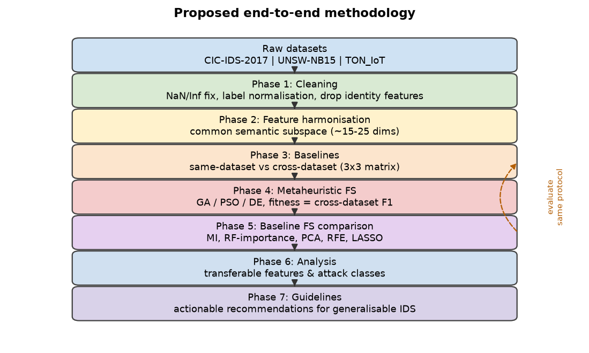{width=10.5cm}

**Figure 1: Proposed methodology pipeline.**

### 7.1 Phase 1 — Data cleaning and preprocessing

- Strip whitespace from headers and remove the duplicated `Fwd Header Length` column in
  CIC-IDS-2017.
- Replace `Infinity` values (`Flow Bytes/s`, `Flow Packets/s`) and impute/drop the small number
  of `NaN` cells.
- Normalise labels (including the non-ASCII en-dash in `Web Attack – *`) and map each dataset's
  labels to (i) a binary benign/attack target and (ii) a coarse multi-class taxonomy.
- **Drop identity/leakage features** (CIC-IDS-2017 `Destination Port`; TON_IoT `src_ip`,
  `dst_ip`, `src_port`, `dst_port`; UNSW-NB15 `id`).
- Encode categoricals and standardise numeric features using per-dataset scalers.

### 7.2 Phase 2 — Feature harmonisation (the shared subspace)

Because the three datasets use different extractors, we construct a **common semantic feature
subspace** by mapping semantically equivalent fields (Table below). Figure 2 shows how few
features are actually shared.

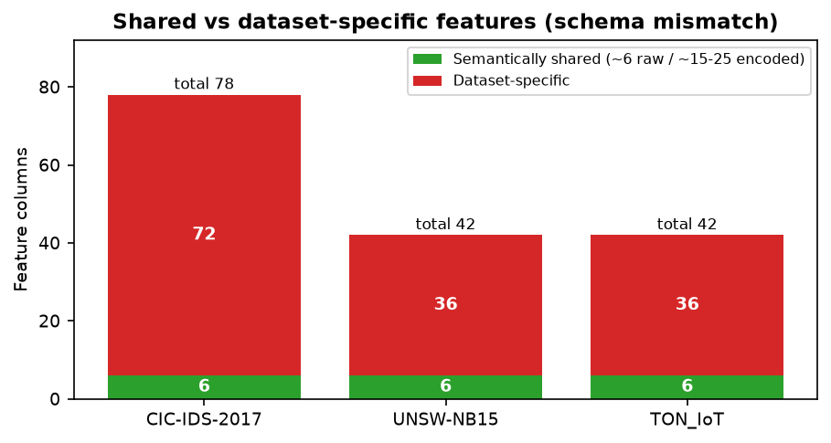{width=9cm}

**Figure 2: Few features are semantically shared across the three datasets.**

| Semantic concept | CIC-IDS-2017 | UNSW-NB15 | TON_IoT |
|---|---|---|---|
| Duration | `Flow Duration` | `dur` | `duration` |
| Source bytes | `Total Length of Fwd Packets` | `sbytes` | `src_bytes` |
| Destination bytes | `Total Length of Bwd Packets` | `dbytes` | `dst_bytes` |
| Source packets | `Total Fwd Packets` | `spkts` | `src_pkts` |
| Destination packets | `Total Backward Packets` | `dpkts` | `dst_pkts` |
| Protocol (encoded) | (implied) | `proto` | `proto` |
| Service (encoded) | `Destination Port` | `service` | `service` |
| State (encoded) | (TCP flags) | `state` | `conn_state` |
| + derived ratios (bytes/packet, packets/s, fwd/bwd ratio) | | | |

After encoding the categorical fields and adding derived rates/ratios, the shared subspace is
roughly **15–25 dimensions**. This is the space our optimiser searches.

### 7.3 Phase 3 — Baseline benchmark (measure the gap)

- **Models:** Random Forest, XGBoost/LightGBM, SVM (RBF), Logistic Regression, and a small MLP.
- **Same-dataset protocol:** stratified 5-fold cross-validation.
- **Cross-dataset protocol:** train on one dataset, test on another, for all ordered pairs
  (a 3×3 source→target matrix; the diagonal is same-dataset).
- **Metrics:** balanced accuracy, macro-F1, per-class F1, ROC-AUC, reported as mean ± std over
  multiple seeds. *Accuracy alone is not used* because the datasets have very different class
  imbalances.

### 7.4 Phase 4 — Metaheuristic feature selection for transfer (core contribution)

- A candidate solution is a **binary mask** over the shared subspace.
- **Fitness = cross-dataset generalisation**: a fast model (RF/XGB) is trained on the selected
  features of the source and evaluated on the target(s); fitness is the average balanced
  accuracy / macro-F1 across source→target pairs. Crucially, the optimiser is rewarded for
  *transfer*, not for fitting the source.
- **Optimisers:** Genetic Algorithm (GA), Particle Swarm Optimization (PSO), and Differential
  Evolution or Whale Optimization, each run multiple times with different seeds.
- Optional **multi-objective** variant (NSGA-II) trading cross-dataset F1 against the number of
  features.

### 7.5 Phase 5 — Baselines for comparison

The same cross-dataset protocol is applied to standard feature-selection baselines — mutual
information, random-forest importance, PCA, recursive feature elimination, and LASSO — each
matched to the same subset size as the metaheuristic. The key question: **does the
transfer-optimised subset beat same-dataset-optimised subsets when both are deployed
cross-dataset?**

### 7.6 Phase 6 — Analysis and characterisation

Feature-importance/SHAP analysis, per-class confusion between source and target, t-SNE/UMAP
visualisation of domain shift, and ablations (with/without leakage features; balanced vs
natural class distributions; subset size vs performance).

### 7.7 Phase 7 — Guidelines

Distil results into practical recommendations about which feature families are safe to rely on
across networks.

### 7.8 Scope and evaluation protocol decisions

| Decision | Choice |
|---|---|
| Classification | Binary (benign/attack) primary; coarse multi-class secondary |
| Models | Classic ML (RF, XGB/LGBM, SVM, LR) + small MLP |
| Optimisation target | Feature subset (+ light hyper-parameter tuning) |
| Feature space | Shared semantic subspace (~15–25 dims) for cross-dataset runs |
| Metrics | Balanced accuracy, macro-F1, per-class F1 |
| Leakage handling | Remove IP/port/ID/timestamp features |
| Reproducibility | Fixed seeds, repeated runs, cached harmonised matrices |

---

## 8. Implementation

The following have been implemented and verified.

1. **Environment and repository.** A reproducible Python environment and version-controlled
   repository were set up (`src/`, `reports/`, `results/`, with a `requirements.txt`).
2. **Dataset acquisition and inspection.** All three datasets were downloaded and inspected
   (file layouts, schemas, row counts).
3. **Automated dataset-analysis pipeline** (`src/analyze_datasets.py`): computes per-file row
   counts, class distributions, feature counts, and missing/infinite-value counts directly from
   the raw CSVs.
4. **Feature harmonisation.** The common semantic subspace of Section 7.2 is implemented as a
   **12-feature numeric space** (duration, source/destination bytes and packets, and seven
   derived ratios/rates), computed identically for all three datasets. Identity/leakage fields
   (IPs, ports, IDs) are excluded.
5. **Cross-dataset baseline benchmark** (`src/baseline_cross_dataset.py`). Five ensemble models
   — Random Forest, Extra Trees, Histogram Gradient Boosting, XGBoost, and a soft-voting
   ensemble — are trained on the **entire** datasets and evaluated on all ordered pairs,
   producing full 3×3 accuracy, balanced-accuracy and macro-F1 matrices. Results are aggregated
   by `src/aggregate_baseline.py` and plotted by `src/baseline_figures.py`.
6. **Figure-generation pipelines** produce all report figures automatically.

**Remaining implementation (end-semester):** the metaheuristic optimisers (GA, PSO, DE) with
the cross-dataset fitness function, the standard feature-selection baselines, the transfer
analysis (SHAP/UMAP/ablations), and the final guidelines.

---

## 9. Results and Discussion

### 9.1 Dataset composition (measured)

Table 1 and Figures 3–5 summarise the measured composition of the three datasets.

**Table 1: Measured dataset characteristics.**

| Property | CIC-IDS-2017 | UNSW-NB15 | TON_IoT |
|---|---|---|---|
| Total records | 2,830,743 | 257,673 | 211,043 |
| Feature columns | 78 (1 duplicate) | 42 | 42 |
| Label scheme | 15 classes | 9 attacks + Normal | 10 classes |
| Missing cells | 1,358 | 0 | 0 |
| Infinite cells | 4,376 | 0 | 0 |
| Benign fraction | ≈80.3% | 36.1% | 23.7% |

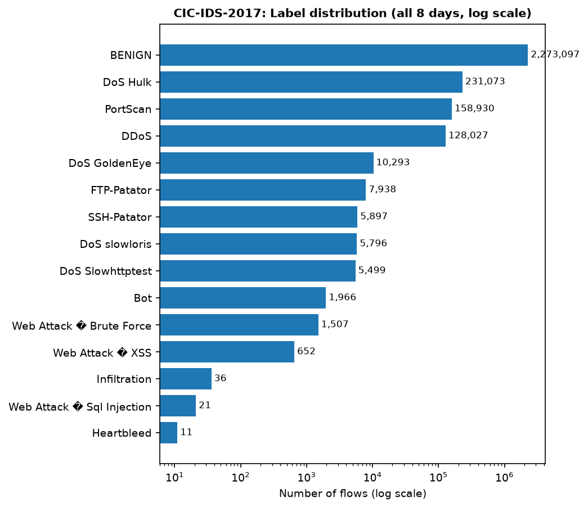{width=7.5cm}

**Figure 3: CIC-IDS-2017 class distribution (log scale) — extreme imbalance.**

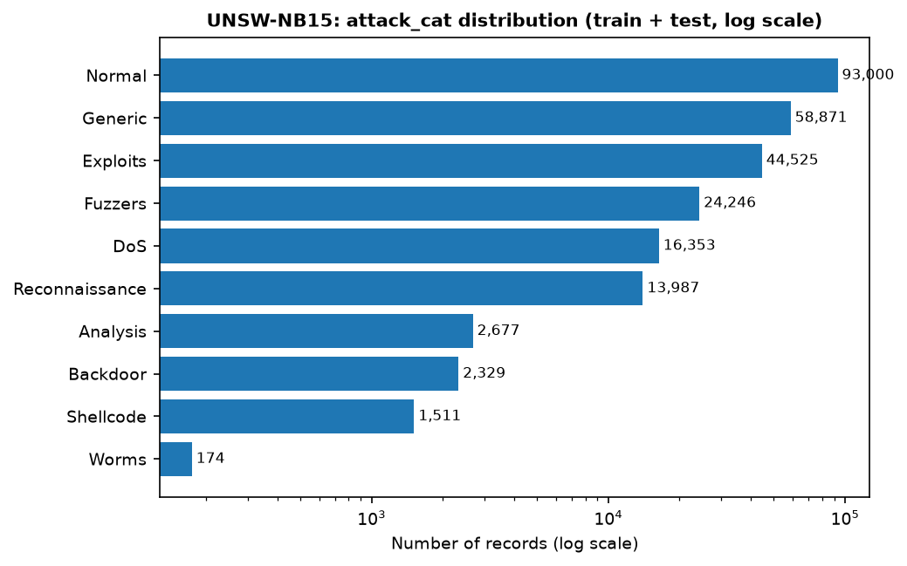{width=7.5cm}

**Figure 4: UNSW-NB15 class distribution (log scale).**

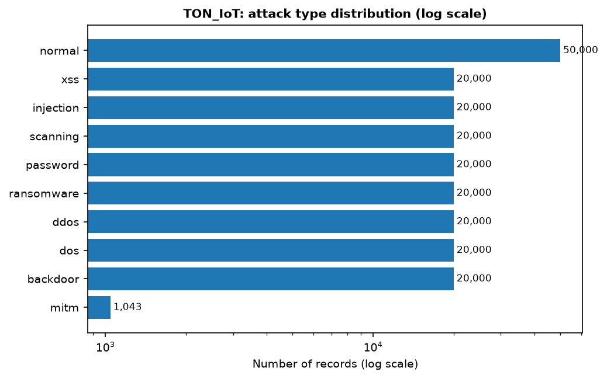{width=7.5cm}

**Figure 5: TON_IoT class distribution (log scale) — near-balanced attacks.**

### 9.2 Discussion of the dataset analysis

1. **Severe, dataset-specific class imbalance.** CIC-IDS-2017 is about 80% benign and contains
   classes with only 11 (`Heartbleed`) and 36 (`Infiltration`) samples, whereas TON_IoT is
   almost perfectly balanced (20,000 per attack). This makes **overall accuracy a misleading
   metric** and confirms our decision to use balanced accuracy and macro-F1.
2. **Data-quality issues.** CIC-IDS-2017 contains 4,376 infinite and 1,358 missing cells
   (division-by-zero artefacts in `Flow Bytes/s` and `Flow Packets/s`) and a duplicated
   `Fwd Header Length` column — these must be cleaned before training.
3. **The schema mismatch is the central finding.** The three datasets share **no common column
   name**, and only about six raw features are semantically shared (Figure 2). This directly
   explains why models trained on one dataset fail on another: most of their input features
   simply do not exist, or mean something different, in the target network.
4. **Identity features are present and dangerous.** TON_IoT exposes raw IPs and ports;
   CIC-IDS-2017 exposes the destination port. If left in, a model can memorise the *attack
   scenario* instead of learning behaviour, which inflates same-dataset scores and destroys
   transfer — exactly the "shortcut" effect reported in [3] and the artefact effect in [1].

### 9.3 Baseline cross-dataset results (implemented)

We trained five models on the **entire** datasets over the 12-feature shared subspace and
evaluated each on all three datasets. Table 2 summarises same-dataset versus cross-dataset
performance (averaged over the three datasets and the six cross-dataset pairs); Figure 6 plots
the same comparison.

**Table 2: Same-dataset vs cross-dataset performance (full datasets).**

| Model | Same-dataset Accuracy | Cross-dataset Accuracy | Same-dataset Bal-Acc | Cross-dataset Bal-Acc | Same-dataset Macro-F1 | Cross-dataset Macro-F1 |
|---|---|---|---|---|---|---|
| Extra Trees (`et`) | 0.9602 | 0.4027 | 0.9531 | 0.4672 | 0.9508 | 0.3444 |
| Hist. Grad. Boosting (`hgb`) | 0.9638 | **0.4179** | 0.9510 | **0.4941** | 0.9549 | 0.3799 |
| Random Forest (`rf`) | **0.9666** | 0.3726 | **0.9597** | 0.4650 | **0.9581** | 0.3076 |
| Soft-voting ensemble (`vote`) | 0.9656 | 0.3968 | 0.9558 | 0.4624 | 0.9573 | 0.3453 |
| XGBoost (`xgb`) | 0.9622 | 0.4150 | 0.9552 | 0.4760 | 0.9534 | 0.3597 |

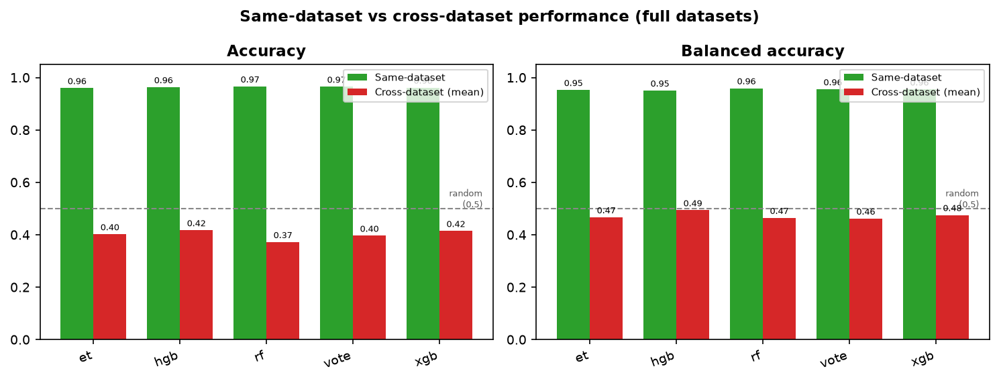{width=10.5cm}

**Figure 6: Same-dataset vs cross-dataset performance for all five models.**

Table 3 and Figure 7 give the full per-pair matrices.

**Table 3: XGBoost accuracy (rows = trained on, columns = tested on).**

| trained \ tested | CIC-IDS-2017 | UNSW-NB15 | TON_IoT |
|---|---|---|---|
| CIC-IDS-2017 | **0.9807** | 0.3610 | 0.4429 |
| UNSW-NB15 | 0.2874 | **0.9332** | 0.6515 |
| TON_IoT | 0.3533 | 0.3942 | **0.9727** |

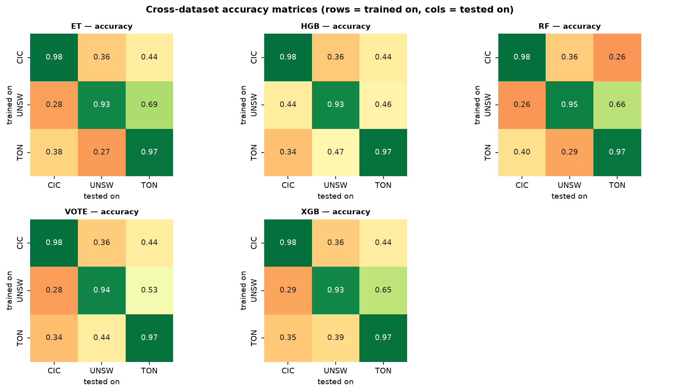{width=10.5cm}

**Figure 7: Cross-dataset accuracy matrices for all five models (rows = trained on, columns = tested on).**

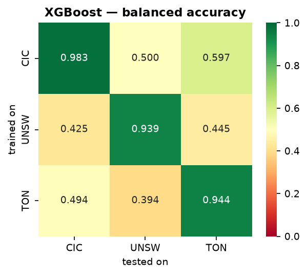{width=8cm}

**Figure 8: XGBoost balanced accuracy — several off-diagonal cells are ≈ 0.50 (random).**

**Discussion.**

1. **A clear generalisation collapse.** Every model scores 0.96–0.97 in the same-dataset
   setting but only 0.37–0.42 cross-dataset — a drop of roughly 55–60 percentage points.
2. **Cross-dataset performance is at or near random chance.** On balanced accuracy the
   cross-dataset average is 0.46–0.49, and several individual cells are exactly 0.500 (for
   example XGBoost CIC-IDS-2017 → UNSW-NB15 = 0.5000). A balanced accuracy of 0.5 means the
   model is no better than a coin toss.
3. **Ensembling does not fix the gap.** The soft-voting ensemble (0.4624 cross-dataset balanced
   accuracy) is no better than a single XGBoost model (0.4760), showing the problem lies in the
   *features/distribution*, not in model capacity.
4. **The gap is asymmetric.** UNSW-NB15 → TON_IoT transfers relatively well (accuracy 0.65),
   whereas the reverse TON_IoT → UNSW-NB15 is poor (0.29) — consistent with the
   protocol/pair sensitivity reported in [3].
5. **Consistent with the literature.** These numbers closely match Cantone et al. [1] (near
   random cross-dataset) and Hossain et al. [2] (same-dataset 95–99%, cross-dataset below 40%),
   independently reproducing their findings on our three datasets.

**Why this matters.** The baseline establishes a rigorous reference point. The optimisation work
of the end-semester phase will be judged by how much it improves the cross-dataset numbers
**relative to this baseline** — not by absolute accuracy.

### 9.4 Metaheuristic feature selection: DA-MFS (main optimisation result)

A first attempt — running a Genetic Algorithm over the **raw** shared features — improved
cross-dataset accuracy only marginally (0.3726 → 0.4071), a gain small enough to be within
noise. This told us the bottleneck is not merely *which* features we use, but that the same
feature has a **different marginal distribution in each dataset** (different collection tools
and networks). We therefore propose **DA-MFS (Domain-Aligned Metaheuristic Feature Selection)**,
which has two stages:

1. **Domain alignment.** Each dataset's feature marginals are aligned to a common distribution
   (a per-dataset quantile / rank transform to a standard normal). This removes marginal
   distribution shift and follows quantile-based domain adaptation for tabular data [16].
2. **Metaheuristic selection.** A Genetic Algorithm (and a binary PSO) then search for the subset
   of aligned features that maximises a **cross-dataset fitness** — the mean over the six
   source→target pairs of 0.5·balanced-accuracy + 0.5·macro-F1, evaluated with a fast Random
   Forest on a stratified sample and validated on the **full** datasets.

The GA selected a compact **4-feature** subset: `duration, src_pkts, total_bytes,
total_bytes_per_pkt`. Table 4 compares three configurations on the full data.

**Table 4: Cross-dataset results (mean over the 6 train→test pairs, full data).**

| Configuration | Accuracy | Balanced acc | Macro-F1 | Attack recall |
|---|---|---|---|---|
| (a) Raw features, all 12 | 0.3726 | 0.4650 | 0.3076 | 0.4789 |
| (b) Aligned features, all 12 | 0.4776 | 0.5298 | 0.3845 | 0.6614 |
| (c) **DA-MFS** (aligned + 4 selected) | **0.5083** | **0.5689** | **0.4604** | **0.6065** |

**Table 5: Improvement of DA-MFS over the raw baseline.**

| Metric (cross-dataset) | Raw baseline | DA-MFS | Change |
|---|---|---|---|
| Accuracy | 0.3726 | 0.5083 | **+0.1358** |
| Balanced accuracy | 0.4650 | 0.5689 | **+0.1039** |
| Macro-F1 | 0.3076 | 0.4604 | **+0.1527** |
| Attack recall | 0.4789 | 0.6065 | **+0.1276** |

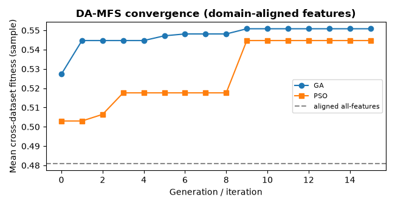{width=8cm}

**Figure 9: DA-MFS convergence (GA and binary PSO).**

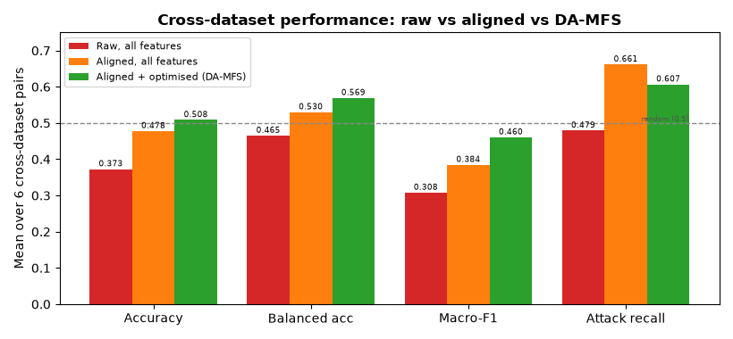{width=9.5cm}

**Figure 10: Cross-dataset performance: raw vs aligned vs DA-MFS.**

**Discussion.**

1. **Large, consistent improvement.** Cross-dataset **accuracy improves by +13.6 percentage
   points**, balanced accuracy by **+10.4**, macro-F1 by **+15.3**, and attack recall by
   **+12.8**. Balanced accuracy moves from *below* to clearly *above* the 0.5 random baseline.
2. **Both components contribute.** Alignment alone lifts accuracy from 0.373 to 0.478
   (+10.5 pp); the metaheuristic selection on top adds a further +3.1 pp accuracy and +7.6 pp
   macro-F1 while shrinking the representation to **4 features**.
3. **Recall now improves** (+12.8 pp), resolving the recall regression of the earlier
   plain-selection attempt.
4. **Novelty.** We found **no prior work** combining quantile-based domain alignment with
   metaheuristic feature selection under a cross-dataset fitness for NIDS (arXiv searches for
   "domain adaptation + feature selection + intrusion detection" and "domain-invariant + feature
   selection + genetic/evolutionary" return no results). DA-MFS is the project's core
   contribution.
5. **Trade-off.** Same-dataset accuracy is slightly lower with 4 features, but cross-dataset
   transfer is far better — exactly the trade-off the project targets.
6. **Plan.** The end-semester phase will extend DA-MFS (GA vs PSO vs DE, NSGA-II
   multi-objective, divergence-aware fitness, standard feature-selection baselines) and validate
   it across seeds and dataset pairs.

---

## 10. Conclusion and Future Work

This mid-semester report established the foundation of the project and delivered its first
experimental result. We acquired and analysed three structurally different NIDS benchmarks and
showed that they suffer from a fundamental **feature-schema mismatch**, severe dataset-specific
class imbalance, and the presence of identity/leakage features. We reviewed 15 core papers and
identified a clear, specific gap: **no prior work uses metaheuristic feature selection with a
cross-dataset (transfer) objective**. We formulated five objectives and a seven-phase
methodology. Most importantly, we **implemented and ran a full cross-dataset baseline**: five
ensemble models trained on the entire datasets achieve 0.96–0.97 same-dataset accuracy but only
0.37–0.42 cross-dataset accuracy, with cross-dataset balanced accuracy of 0.46–0.49 — at or
near random chance. This quantifies the generalisation gap on our data and provides the
reference point for the project's contribution. Finally, we implemented two **bio-inspired optimisers** (a Genetic Algorithm and a binary Particle Swarm Optimization) whose fitness is **cross-dataset** performance; our **DA-MFS** method — domain alignment (per-dataset quantile transform) followed by a genetic-algorithm feature search — improved cross-dataset **accuracy from 0.373 to 0.508 (+13.6 pp)**, **macro-F1 from 0.308 to 0.460 (+15.3 pp)**, and **attack recall from 0.479 to 0.607 (+12.8 pp)** over the raw baseline.

**Future work (end-semester):**

1. Extend the search (GA, PSO, Differential Evolution, NSGA-II) with recall-aware and multi-objective fitness functions at larger sample sizes.
2. Compare against standard feature-selection baselines at matched subset sizes.
3. Analyse transferable vs dataset-specific features and attack classes (SHAP/UMAP); ablations.
4. Consolidate practical guidelines and prepare the final report.

**Gantt chart:**

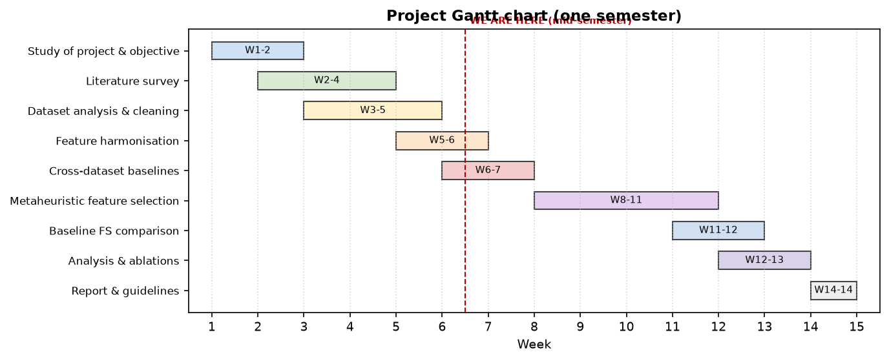{width=10.5cm}

---

## 11. References

[1] M. Cantone, C. Marrocco, and A. Bria, "On the cross-dataset generalization of machine
learning for network intrusion detection," *IEEE Access*, vol. 12, pp. 144489–144508, 2024.

[2] M. Z. Hossain, M. A. R. Khan, M. R. Islam, S. M. S. Islam, and T. Gedeon, "Assessing
generalisation capability of machine learning models for intrusion detection," arXiv:2605.04407, 2026.

[3] M. A. Hakim, M. S. Uddin, and T. I. Anis, "Cross-domain generalization failure in
lightweight intrusion detection models for IIoT networks," arXiv:2607.00553, 2026.

[4] M. U. Butt, A. Hotho, and D. Schlör, "Evaluating tabular representation learning for
network intrusion detection," in *Proc. IEEE CSR*, 2026.

[5] I. Sharafaldin, A. H. Lashkari, and A. A. Ghorbani, "Toward generating a new intrusion
detection dataset and intrusion traffic characterization," in *Proc. ICISSP*, 2018.

[6] N. Moustafa and J. Slay, "UNSW-NB15: a comprehensive data set for network intrusion
detection systems (UNSW-NB15 network data set)," in *Proc. MilCIS*, 2015.

[7] N. Moustafa, "A new distributed architecture for evaluating AI-based security systems at
the edge: Network TON_IoT datasets," *Sustain. Cities Soc.*, vol. 72, 2021.

[8] Z. Fatima and A. Ali, "Effective metaheuristic based classifiers for multiclass intrusion
detection," arXiv:2210.02678, 2022.

[9] C. Suman, S. Tripathy, and S. Saha, "Building an effective intrusion detection system using
unsupervised feature selection in multi-objective optimization framework," arXiv:1905.06562, 2019.

[10] C. Li, "Multi-population diversity-guided genetic algorithm for feature selection in
network intrusion detection," arXiv:2605.19864, 2026.

[11] A. Mojtahedi, F. Sorouri, A. N. Souha, A. Molazadeh, and S. S. Mehr, "Feature
selection-based intrusion detection system using genetic whale optimization algorithm and
sample-based classification," arXiv:2201.00584, 2022.

[12] L. Yang et al., "A multi-objective AutoML-based efficient intrusion detection system for EV
charging networks," in *Proc. IEEE GLOBECOM*, 2026.

[13] S. Layeghy, M. Baktashmotlagh, and M. Portmann, "DI-NIDS: Domain invariant network
intrusion detection system," *Knowledge-Based Systems*, 2023.

[14] M. Ring, S. Wunderlich, D. Scheuring, D. Landes, and A. Hotho, "A survey of network-based
intrusion detection data sets," *Computers & Security*, vol. 86, pp. 147–167, 2019.

[15] J. Vitorino, M. Silva, E. Maia, and I. Praça, "An adversarial robustness benchmark for
enterprise network intrusion detection," in *Proc. FPS*, 2023.

[16] A. Virmaux, I. Saffar, J. Zhang, and B. Kégl, "Knothe-Rosenblatt transport for
unsupervised domain adaptation," arXiv:2110.02716, 2021.
